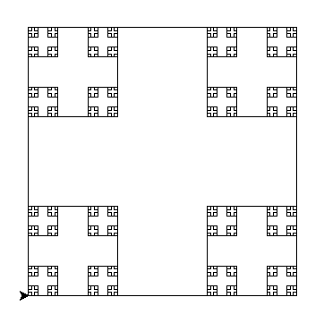
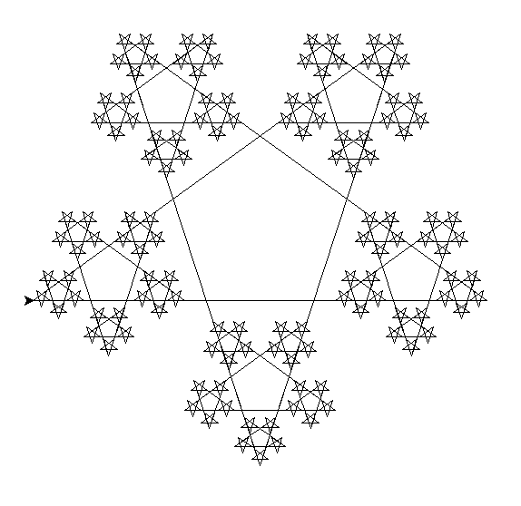

I have recently learnt how to make some simple fractals by python at university.   <br>
let's take a look are my square, triangle and star and their codes:



```
import turtle

def square(d):
    if d<3:
        return
    turtle.tracer()
    turtle.speed(0)
    for i in range(4):
        square(d/3)
        turtle.forward(d)
        turtle.left(90)
    turtle.update()

square(300)
turtle.mainloop()
```


```
import turtle
turtle.speed(0)
turtle.hideturtle()

def triangle(d):
    if d<5:
        return
    for _ in range(3):
        triangle(d/2)
        turtle.forward(d)
        turtle.left(120)

turtle.tracer(0)
triangle(300)
turtle.update()
turtle.mainloop()
```



```
import turtle

def star(d):
    if d<7:
        return
    for i in range(5):
        star(d/3)
        turtle.forward(d)
        turtle.left(144)

turtle.tracer(0)
star(500)
turtle.update()
turtle.mainloop()
```
